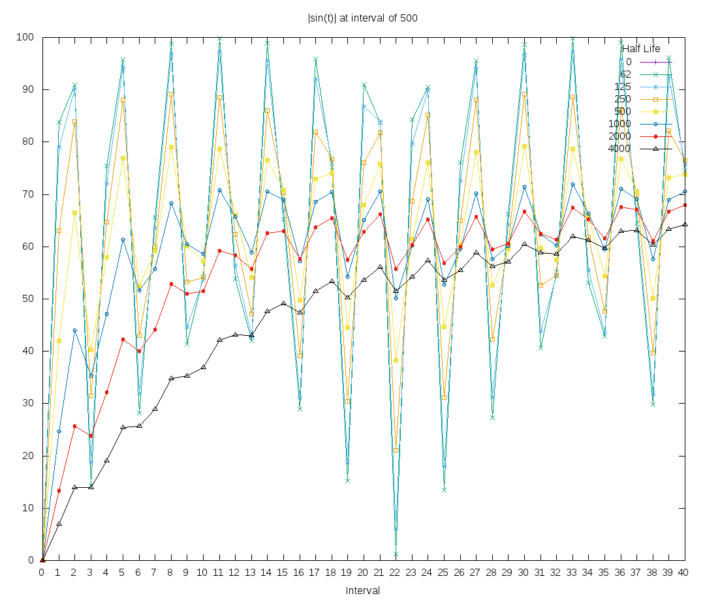
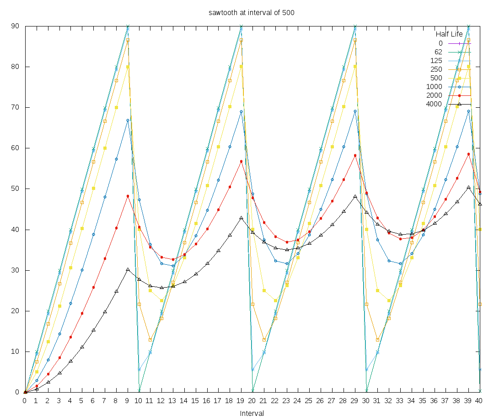

[](https://npmjs.org/package/ewma)
[](https://travis-ci.org/ReactiveSocket/ewma)

# EWMA

An exponential weighted moving average for Node.js and the browser!

```bash
npm install -g ewma
```

# Usage

Compute the exponential weighted moving average of a series of values.  The
time at which you insert the value into `Ewma` is used to compute a weight
(recent points are weighted higher).  The parameter for defining the
convergence speed (like most decay process) is the half-life.

e.g. with a half-life of 10 unit, if you insert 100 at t=0 and 200 at t=10 the
ewma will be equal to (200 - 100)/2 = 150 (half of the distance between the new
and the old value).

### `var ewma = new EWMA(halfLifeMs, initialValue, clock)`

* `halfLifeMs` - `{Number}` parameter representing the speed of convergence
* `initialValue` - `{Number}` initial value
* `clock` - Optional `{Number}` clock object used to read time, must support
            `Date.now()` style method. Defaults to `Date`.

returns an object computing the ewma average

### `ewma.insert(x)`

* `x` - The next value, `ewma` will automatically compute the EWMA based on the
        clock difference between this value and the last time `insert` was
        called

### `ewma.reset(x)`

* `x` - Set the EWMA to exactly `x`.

### `ewma.value()`

Returns the current EWMA value.

### Examples

These are generated using a 500ms interval with a half life indicated in the
key. For the source code, or to reproduce yourself, check the
[Example](./example) directory.





## Contributions
Contributions welcome, please ensure `make` runs clean.

## License
MIT
